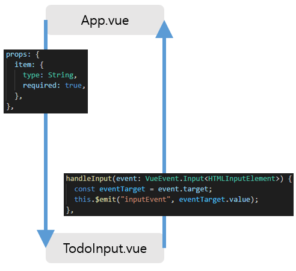

# 📝TODO LIST
Vue.js + TypeScript를 공부하기위해 TodoList를 만들었습니다.

<br>

- 개인 프로젝트
- 개발기간 : 2022.01 (2주)
- <a href="https://todo523.herokuapp.com" target="_blank">배포된 프로젝트 링크</a>
- <a href="https://github.com/wogha95/vue-typescript-todo-deploy" target="_blank">배포된 프로젝트 github</a>

<br>

## ⚙Environment
- Vue CLi 4.5.15
- Vue 2.6.11

<br>

## 🗂프로젝트 구조


<br>

## ✔특징
### 1. 커스텀 타입 정의
``` js
// TodoInput.vue
// line 
handleInput(event: InputEvent) {
  // event.target이 EventTarget | null 로 추론되는데 이는 2가지 문제점을 가짐
  // 문제1. event.target이 null일 가능성 있음 → InputElement 
  // 문제2. event.target.value 접근 불가능 → HTMLInputElement의 속성에 value가 있음
},
```
- 문제1은 InputEvent의 상위 interface로 올라가면 (InputEvent → UIEvent → Event) Event의 속성의 target이 아래와 같이 정의되어 있다. 이를 해결하기 위해 InputEvent의 target속성을 null이 아닌 타입으로 재정의한 타입을 이용한다.
``` js
readonly target: EventTarget | null;
```

- 문제2는 EventTarget 안에는 실행되기 전에 타입추론을 할 수 없으므로 해당 로직을 수행할 때 해당 EventTarget이 HTMLInputElement라는 것을 알려줘야한다. 이는 제네릭을 이용하여 해결할 수 있으며 문제1의 target의 속성을 HTMLInputElement로 재정의하면 해당 문제를 모두 해결할 수 있다.
``` js
// types/index.ts
export interface Input<T extends EventTarget> extends InputEvent {
  target: T;
}
```

- 해결된 코드
``` js
// TodoInput.vue
// line
handleInput(event: VueEvent.Input<HTMLInputElement>) {
  const eventTarget = event.target;
  this.$emit("inputEvent", eventTarget.value);
},
```

<br>

### 2. v-model을 사용하지 않고 props와 emit을 이용하여 2-way 데이터 바인딩

v-model을 이용하면 한글의 입력이 즉시 바인딩되지 않는 현상이 일어난다. 따라서 키보드가 눌렸을 때 TodoInput.vue에서 emit을 이용하여 App.vue에 있는 input값을 변경하고 변경된 input값은 다시 TodoInput.vue로 props로 전달하는 방법으로 해결한다.

<br>

<br>

## 🔗참고
- [캡틴판교 - Vue.js + TypeScript 완벽 가이드](https://www.inflearn.com/course/vue-ts)
- [Heroku 에 Vue.js 배포하는 방법](https://medium.com/@ave10987/%EB%B2%88%EC%97%AD-vue-webpack%EC%9D%84-%EC%82%AC%EC%9A%A9%ED%95%98%EC%97%AC-heroku%EC%97%90-%EB%B0%B0%ED%8F%AC-%ED%95%98%EB%8A%94-%EB%B0%A9%EB%B2%95-5dcf8b05ea84)
```
1. npm run build 실행
2. 생성된 dist 폴더 내부에 package.json, server.js 생성

// package.json
{
 "name": "blog",
 "version": "1.0.0",
 "description": "personalblog",
 "author": "Awesome Author",
 "private": true,
 "scripts": {
   "postinstall": "npm install express"
 }
}

// server.js
var express = require('express');
var path = require('path');
var serveStatic = require('serve-static');

app = express();
app.use(serveStatic(__dirname));

var port = process.env.PORT || 5000;
app.listen(port);

console.log('server started '+ port);

3. dist 폴더만 github의 repository에 push한다.
4. heroku.com에서 해당 repository를 연결하고 배포한다.
```
